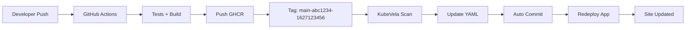

# 🤖 GitOps Automatique - Surveillance GHCR

Ce système met en place une surveillance automatique des images Docker sur GitHub Container Registry (GHCR) et déploie automatiquement les nouvelles versions sans intervention manuelle.

## 🔄 Fonctionnement

### 1. Push Code → GitHub Actions

```bash
git push origin main
```

- Déclenche le workflow `.github/workflows/deploy.yml`
- Tests + Build + Push vers GHCR avec tag unique `main-<sha>-<timestamp>`

### 2. KubeVela GitOps Surveillance

- **Fréquence :** Toutes les 2 minutes
- **Registry :** `ghcr.io/legolas49/back-dev-bfirstai`
- **Pattern :** `^main-[a-f0-9]{7}-(?P<ts>[0-9]+)$`
- **Politique :** Plus récent en premier (`desc`)

### 3. Mise à Jour Automatique

Quand une nouvelle image est détectée :

1. 🔄 KubeVela met à jour `kubevela/backoffice-dev.yaml`
2. 📝 Commit automatique : `🤖 Auto-update image: <nouvelle-image>`
3. 🚀 Redéploiement automatique de l'application
4. ✅ Site mis à jour sans intervention

## 📋 Configuration

### Prérequis

1. **Token GitHub** avec permissions :
   - `repo` (accès complet au repository)
   - `write:packages` (lecture GHCR)

2. **Secret Kubernetes** pour écriture GitHub

### Installation

```bash
# 1. Créer le secret GitHub
export GITHUB_TOKEN=ghp_your_token_here
./scripts/create-github-secret.sh

# 2. Déployer GitOps
./scripts/deploy-gitops.sh
```

## 🛡️ Protection contre les Boucles

Le workflow GitHub Actions ignore automatiquement les commits de KubeVela :

```yaml
# Évite les boucles infinies
if: |
  !contains(github.event.head_commit.message, '🤖 Auto-update image:')
```

## 📊 Monitoring

```bash
# Voir les applications KubeVela
vela ls -n backoffice-dev

# Voir les logs GitOps
kubectl logs -f deployment/backoffice-dev-image-gitops -n backoffice-dev

# Voir l'historique des images
kubectl describe application backoffice-dev-image-gitops -n backoffice-dev
```

## 🔧 Dépannage

### GitOps ne détecte pas les nouvelles images

```bash
# Vérifier le secret GitHub
kubectl get secret github-write-secret -n backoffice-dev

# Vérifier les logs
kubectl logs -f -l app.oam.dev/component=image-gitops -n backoffice-dev
```

### Application pas mise à jour

```bash
# Forcer une synchronisation
kubectl annotate application backoffice-dev-image-gitops \
  -n backoffice-dev \
  fluxcd.io/reconcile=$(date +%s)
```

## 🎯 Avantages

✅ **Déploiement automatique** : Plus besoin de `kubectl rollout restart`  
✅ **Tags uniques** : Fini les problèmes avec `:latest`  
✅ **GitOps natif** : Historique des changements dans Git  
✅ **Évite les boucles** : Protection contre les commits automatiques  
✅ **Surveillance continue** : Détection rapide des nouvelles images

## 📝 Workflow Complet



## 🏷️ Format des Tags

- **Pattern :** `main-<7-char-sha>-<unix-timestamp>`
- **Exemple :** `main-abc1234-1627123456`
- **Extraction :** Timestamp pour tri chronologique
- **Politique :** Plus récent (`desc`) = déploiement de la dernière version
